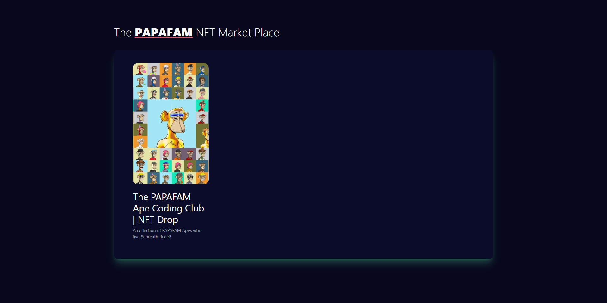
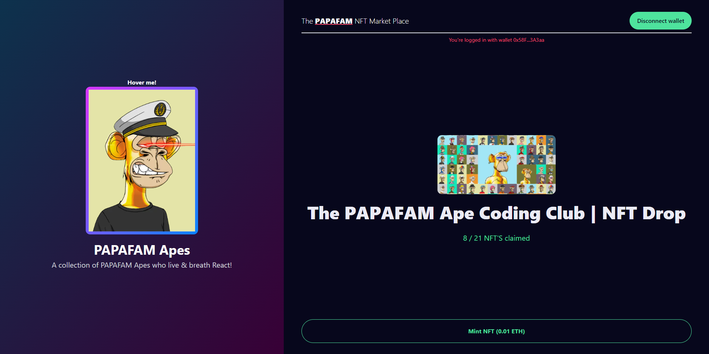

<h1 align="center">NFT Challenge</h1>

---

## Be Welcome!

Thanks for checking out this project!

This project is part of [Sonny Sangha](https://www.youtube.com/channel/UCqeTj_QAnNlmt7FwzNwHZnA) Challenge tutorials.

**Don't forget to set your own environment variables.**

## Links

- Sonny Sangha NFT Challenge: [NFT](https://www.youtube.com/watch?v=B1pnHVdnN64)
- Live site: [NFT Drop](https://nft-challenge-papafam.vercel.app/)

## Built with

- [React](https://reactjs.org/) - JS library
- [Next.js](https://nextjs.org/) - React framework
- [Tailwind css](https://tailwindcss.com/) - CSS framework
- [Sanity](https://www.sanity.io/) - CMS
- [Thirdweb](https://docs.thirdweb.com/react) - Thirdweb react SDK
- [Atropos](https://atroposjs.com/) - 3D parallax hover effects
- [Framer Motion](https://www.framer.com/motion/) - Animations
- [React Hot Toast](https://react-hot-toast.com/) - Toasts

## Useful resources

- [Atropos](https://atroposjs.com/docs/react) - Atropos docs
- [Metamask](https://metamask.io/) - Web3 wallet
